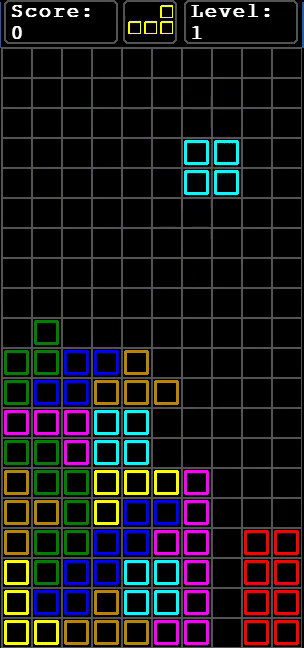

# PyTetris
A basic implementation of Tetris, coded in Python using Pygame, compiled to JavaScript using Pyjs with Pyjsdl. 



## How to run
python3 and pygame library must be installed to run PyTetris. 

This can be achieve in ubuntu by doing:

```bash
sudo apt install python3
```
```bash
python3 -m pip install -u pygame --user
```
Once the dependancies have been met the game can be run as follows:
```bash
python3 main.py
```

## Controls
Normal keyboard controls are as follows:
| Normal Keys |  Action         |
|------------ |-----------------|
| Left Arrow  | Move Left       |
| Rigth Arrow | Move Right      |
| Z           | Rotate Left     |
| X           | Rotate Right    |
| Down Arrow  | Soft Drop       |
| Space       | Hard Drop       |
| P           | Pause           |
| R           | Restart         |

Additionally in this branch, partial controls are implemented in buttons to the right of the main grid.

If the DEBUG variable under modules/globals.py is greater than 0 then the following additional controls are enabled:

|Debug key  |Action                               |
|-----------|-------------------------------------|
| Page Up   | Increase debug level                |
| Page Down | Decrease debug level                |
| 1 Key     | Respawn current block               |
| 2 Key     | Reset grid                          |
| 3 Key     | Print raw 2d block array to console |
| 4 Key     | Print raw 2d grid array to console  |
| 5 Key     | Increase current game level         |
| 6 Key     | Decrease current game level         |
| 7 Key     | Incrase current score               |


