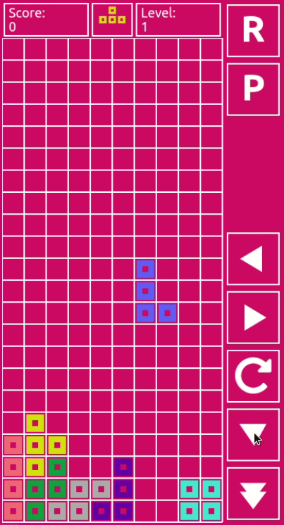

# PyTetris
My basic little implementation of tetris in python using the pygame library.



## How to run
python2.7 or python3 and pygame library must be installed to run PyTetris. 

For example, to install python3 and pygame on a debian linux system:

```bash
sudo apt install python3
```
```bash
python3 -m pip install -u pygame --user
```
Once the dependancies have been met the game can be run as follows:
```bash
python3 main.py
```

## Controls
### Keyboard
| Key         |  Action         |
|------------ |-----------------|
| Left Arrow  | Move Left       |
| Rigth Arrow | Move Right      |
| Down Arrow  | Soft Drop       |
| Enter       | Hard Drop       |
| Space       | Rotate          |
| p           | Pause/Play      |
| r           | Restart         |
| Esc         | Exit the game   |

### Mouse
| Action      |  Action         |
|------------ |-----------------|
| Left Click + Drag Left   | Move Left       |
| Left Click + Drag Right| Move Right      |
| Left Click + Drag Down  | Soft Drop       |
| Double Click| Rotate          |

### Debug
|Key       |Action                               |
|----------|-------------------------------------|
|Page Up   | Increase debug level                |
|Pade Down | Decrease debug level                |
|0 Key     | Reset grid                          |
|1 Key     | Next Block                          |
|2 Key     | Print grid array to console         |
|B Key     | Print current bock array to console |


